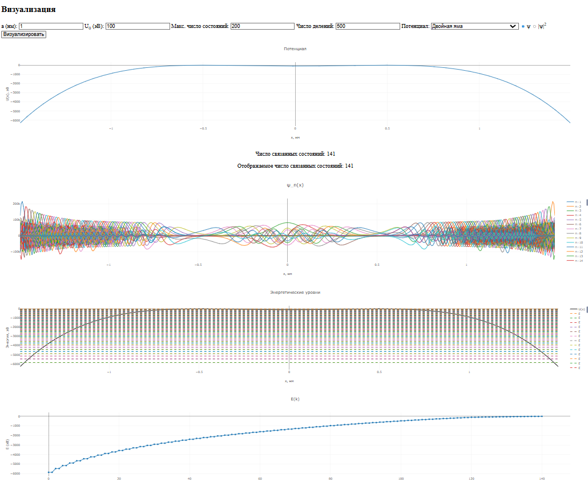

### Задание
Используя уравнение Шредингера, найти связные состояния и соответствующие им собственные значения в случае потенциальной ямы произвольной формы, задаваемого аналитической или таблично заданной функцией U(x) в диапазоне от 0  до a, где a - ширина ямы. Построить графически собственные функции.

### Визуализация решения
